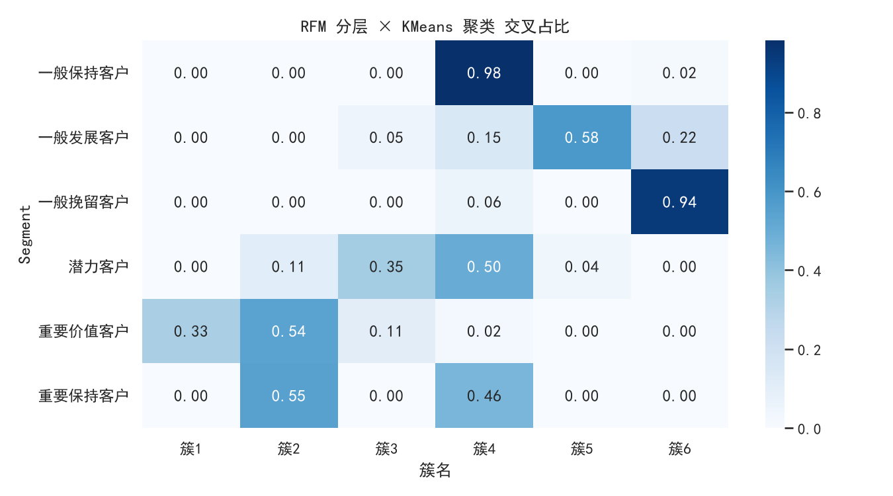
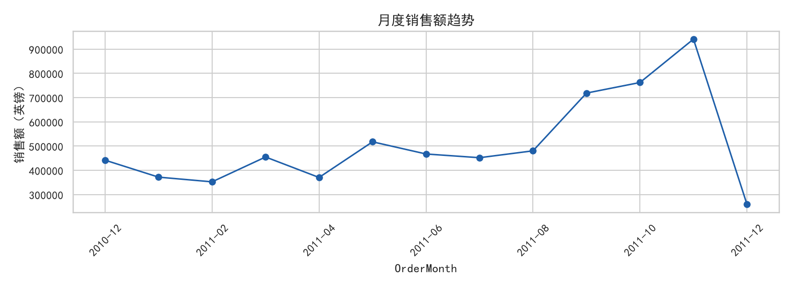
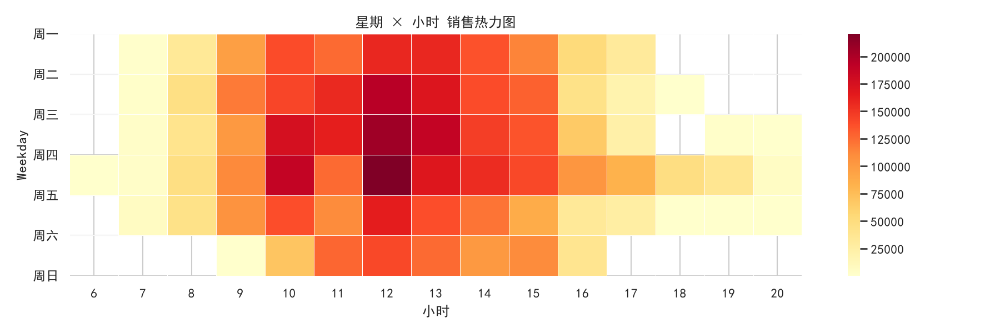

# Retail Customer Value Analysis · 零售用户价值分析

> 基于 UCI Online Retail 数据集的完整数据分析项目：数据清洗 → 探索性分析 → RFM 用户分层 →
> KMeans 交叉验证 → Cohort 同期群留存 → Power BI 交互式看板。


---

## 目录

- [项目背景](#项目背景)
- [数据集](#数据集)
- [快速开始](#快速开始)
- [分析流程](#分析流程)
- [核心结论](#核心结论)
- [方法亮点](#方法亮点)
- [项目结构](#项目结构)
- [Power BI 看板](#power-bi-看板)
- [免责声明](#免责声明)

---

## 项目背景

一家英国在线零售企业积累了 13 个月、54 万条交易记录，但缺乏对客户价值的系统认知：
谁是高价值客户？新客留不住的原因在哪？运营资源该往哪投？

本项目从零搭建完整分析链路，回答三个业务问题：

1. **客户价值结构**：哪些客户贡献了大部分营收？
2. **留存健康度**：新客在什么时候流失？
3. **运营优先级**：有限的营销预算应该先投给谁？

---

## 数据集

**UCI Online Retail**（公开数据集，非商业机密数据）

| 属性 | 值 |
| --- | --- |
| 来源 | [UCI Machine Learning Repository](https://archive.ics.uci.edu/dataset/352/online+retail) |
| 原始规模 | 541,909 行 × 8 列 |
| 时间跨度 | 2010-12-01 ~ 2011-12-09（13 个月） |
| 业务形态 | 英国批发型在线零售（客户多为经销商） |
| 币种 | 英镑（GBP） |

### 字段字典

| 字段 | 含义 | 清洗注意事项 |
| --- | --- | --- |
| `InvoiceNo` | 订单号 | 以 `C` 开头的是**退货/取消单** |
| `StockCode` | 商品编码 | — |
| `Description` | 商品名称 | 存在缺失与大小写不一致 |
| `Quantity` | 数量 | 负数为退货 |
| `InvoiceDate` | 下单时间 | 精确到分钟 |
| `UnitPrice` | 单价 | 存在 0 值（赠品/漏填） |
| `CustomerID` | 客户 ID | **缺失约 25%**，缺失行无法参与 RFM |
| `Country` | 国家 | 英国占绝大多数 |

> 数据集不随仓库分发（41 MB，且为第三方数据）。获取方式见 [`data/README.md`](data/README.md)。

---

## 快速开始

```bash
# 1. 克隆仓库
git clone https://github.com/<your-name>/retail-rfm-analysis.git
cd retail-rfm-analysis

# 2. 安装依赖
pip install -r requirements.txt

# 3. 放原始数据
#    下载 Online Retail.xlsx 放到项目根目录，或改 notebooks 里的 SRC 路径

# 4. 运行
jupyter notebook notebooks/01_retail_rfm_analysis.ipynb
```

Notebook 按 `# %%` 分格，从环境配置到最终结论**从上到下跑一遍即可**，
所有中间产物（CSV / PNG）会自动写入 `output/`。

---

## 分析流程

```
原始 Excel (54万行)
      │
      ▼
┌─────────────┐   5 条清洗规则
│  数据清洗    │   去无客户ID → 去退货 → 去非正值 → 派生字段 → 99分位截断
└─────────────┘   保留 39万行 / 4,284 客户
      │
      ▼
┌─────────────┐   月度趋势 · 时段热力 · TOP商品 · TOP国家
│  EDA 探索    │   → 6 张图
└─────────────┘
      │
      ├──────────────────┐
      ▼                  ▼
┌─────────────┐   ┌──────────────┐
│ RFM 分层     │◄──│ KMeans 验证   │  轮廓系数选k / ARI / 覆盖率
│ (6 类人群)   │   │ (交叉印证)    │
└─────────────┘   └──────────────┘
      │
      ▼
┌─────────────┐   同期群留存矩阵
│ Cohort 留存  │   → 次月留存 20.3%
└─────────────┘
      │
      ▼
┌─────────────┐
│ Power BI     │   三页交互式看板
│ 看板交付     │
└─────────────┘
```

### 清洗规则（顺序不可乱）

| # | 规则 | 原因 |
| --- | --- | --- |
| 1 | 剔除无 `CustomerID` 的行 | 无法归属到用户，不能参与 RFM |
| 2 | 剔除 `InvoiceNo` 以 `C` 开头的行 | 退货/取消单 |
| 3 | 只保留 `Quantity > 0` 且 `UnitPrice > 0` | 排除赠品与漏填 |
| 4 | 派生 `TotalPrice / OrderMonth / Hour / Weekday` | 供后续所有分析复用 |
| 5 | `UnitPrice`、`TotalPrice` 99 分位截断 | 防止极端批发单主导分层 |

> 保留率约 72%。截断会连带删除部分客户的全部交易，因此客户数从 4,372 降至 **4,284** —— 这是预期结果。

---

## 核心结论

### 1. 营收呈典型帕累托结构

| 人群 | 人数 | 人数占比 | GMV 占比 | 人均 R（天） | 人均 GMV（£） | 运营含义 |
| --- | --- | --- | --- | --- | --- | --- |
| 重要价值客户 | 975 | 22.8% | **69.5%** | 24.7 | 4,700 | 核心资产，重点维护 |
| 潜力客户 | 1,150 | 26.8% | 18.7% | 49.8 | 1,072 | **最值得投入的升级人群** |
| 一般发展客户 | 1,305 | 30.5% | 6.5% | 65.1 | 327 | 低频低额，观察 |
| 一般挽留客户 | 730 | 17.0% | 3.1% | 273.5 | 278 | 真流失，控制投入 |
| 一般保持客户 | 113 | 2.6% | 1.7% | 237.5 | 1,010 | 维持基础触达 |
| 重要保持客户 | 11 | 0.3% | 0.5% | 237.1 | 2,915 | 高价值流失极少 |

> 全量复现结果（4,284 名客户，总销售额 6,590,533 英镑）。

<p align="center">
  
</p>

### 2. 运营重点应是「升级」而非「唤醒」

高价值客户流失率仅 **1.1%**（986 人中仅 11 人流失）—— 批发型零售靠长期供应关系维系，
客户不会"悄悄消失"。因此真正的抓手是**潜力客户**：1,150 人、贡献 18.7%、人均仅 49.8 天未购
（仍然活跃），通过复购激励把他们推上高价值层的 ROI 远高于唤醒沉睡客户。

### 3. 新客次月留存仅 20.3%，首购后 30 天是核心流失窗口

| 指标 | 数值 |
| --- | --- |
| 次月留存（全部同期群） | **20.3%** |
| 次月留存（剔除首个同期群） | 18.9% |

留存曲线在第 3、9~11 个月明显**回升**，这是零售的季节性（圣诞采购季客户周期性回流），
与 App 类数据的单调衰减不同。

### 4. 销售高度集中于工作日与 Q4

<p align="center">
  
</p>
<p align="center">
  
</p>

- 9~11 月为旺季，2011-12 骤降是因为该月只有 9 天数据；
- **周末整行空白** —— 该公司周末不处理订单（反直觉发现）；
- 高峰时段集中在 10~15 点。

---

## 方法亮点

### RFM 分层：三版迭代才定稿

| 版本 | 做法 | 问题 |
| --- | --- | --- |
| v1 | R/F/M 各自 ≥ 均值即判为"高" | 高价值层占到 **30%**，区分度不足 |
| v2 | 加权综合分 `0.2R + 0.3F + 0.5M`，80 分位切层 | R 权重被 F/M 稀释，且 R 与 F/M 正相关 → "重要保持客户"只剩 **0.6%** |
| **v3（定稿）** | **价值由 F/M 决定，活跃状态由 R 独立判定** | 结构合理，通过聚类交叉验证 |

**核心洞察**：R（近度）是**状态标签**，不是价值组成部分。
"这个客户值多少钱"由消费行为（频次、金额）定义，"他现在活不活跃"由近度判断 ——
两者揉进一个加权分数，流失信号会被自动掩盖。

详细说明见 [`docs/分析方法与迭代记录.md`](docs/分析方法与迭代记录.md)。

### KMeans 交叉验证

| 判据 | 结果 | 判断 |
| --- | --- | --- |
| 轮廓系数 | k=2 最优（0.435），k=6 为 0.316 | 几何上天然分两大团，但业务需要更细粒度 → 选 k=6 |
| ARI | **0.408** | 0.3~0.6 = 结构吻合、边界不同，正常 |
| 高价值簇覆盖率 | **97.9%** | 重要价值客户几乎全部落入聚类识别的高价值簇（簇1 33.3% + 簇2 54.1% + 簇3 10.6%） |
| 秩相关 | Spearman ρ = **0.986** | 簇人均 GMV 与簇内高价值客户浓度几乎完全单调一致 |

### 其他关键指标

| 指标 | 数值 |
| --- | --- |
| 复购率（下过 ≥2 单的客户占比） | 65.2% |
| 客单价 | 368.15 英镑 |
| 件单价 | 16.88 英镑 |
| 清洗后交易行数 | 390,357（保留率 72.0%） |

> ⚠️ 诚实说明：两套方法使用**同一组特征**（R/F/M），因此这不是严格意义上的独立验证，
> 只能算"同一特征上两种划分逻辑的互相印证"。

### 两个代码细节（踩过的坑）

- `Recency` 基准日必须取 `最大日期 + 1 天`，否则最近下单的人 Recency = 0；
- `Frequency` 有大量重复值（很多人只下过 1 单），`qcut` 前必须 `rank(method='first')`，否则报错。

---

## 项目结构

```
retail-rfm-analysis/
├── README.md                          # 本文件
├── requirements.txt                   # 依赖清单
├── .gitignore
├── LICENSE
├── notebooks/
│   └── 01_retail_rfm_analysis.ipynb   # 主分析 Notebook（含完整 Markdown 讲解）
├── src/
│   └── 01_零售分析完整流水线.py        # 等价的 .py 版本（便于 IDE 调试）
├── docs/
│   ├── 分析方法与迭代记录.md           # 方法选型、踩坑与修正
│   └── PowerBI看板-逐步操作手册.html  # 三页看板的逐步操作说明
├── data/
│   └── README.md                      # 数据获取方式（原始数据不入库）
└── output/
    ├── 01_gmv_trend.png
    ├── 02_heatmap_weekday_hour.png
    ├── 03_top_items.png
    ├── 04_top_countries.png
    ├── 05_gmv_by_hour.png
    ├── 06_uk_share.png
    ├── 07_kmeans_k.png
    └── 08_crosstab.png
```

> `retail_clean.csv`（41 MB）、`rfm.csv`、`retention.csv` 等中间产物由脚本生成，已在 `.gitignore` 中排除。

---

## Power BI 看板

三页交互式看板，数据源为 `output/` 导出的 CSV：

| 页面 | 内容 | 关键视觉对象 |
| --- | --- | --- |
| 第 1 页 · 销售概览 | 4 个 KPI 卡片、月度 GMV 趋势、国家 TOP10、星期×小时热力、商品 TOP10、国家切片器 | 折线图 + 矩阵热力 |
| 第 2 页 · 用户分层 | RFM 散点图、人数 vs GMV 帕累托组合图、分层明细表、复购率卡片、Segment 切片器 | 散点 + 折线柱形组合 |
| 第 3 页 · 留存商品 | Cohort 留存热力矩阵、商品 TOP20 帕累托、价格带分布 | 矩阵条件格式色阶 |

逐步操作说明见 [`docs/PowerBI看板-逐步操作手册.html`](docs/PowerBI看板-逐步操作手册.html)。

---

## 免责声明

- 本项目使用 **UCI 公开数据集**，为**个人练手项目**，不涉及任何企业真实数据；
- 所有结论均可由 `notebooks/` 中的代码复现，未做任何数据美化或结果编造；
- 数据集中存在的左截断（首个同期群）、右截断（末月）问题已在分析中显式说明。

---

## 作者

数据分析方向个人项目 · 2026
如有问题欢迎 Issue 交流。
